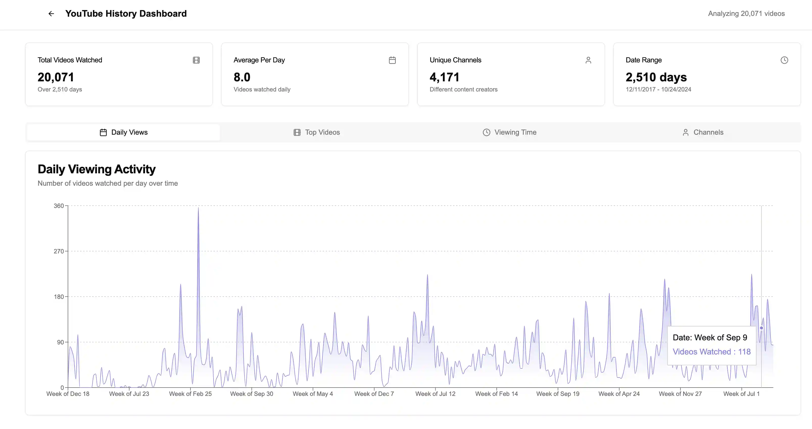

# YouTube History Analyzer

<a href="https://www.producthunt.com/posts/yt-history?embed=true&utm_source=badge-featured&utm_medium=badge&utm_souce=badge-yt&#0045;history" target="_blank"></a>

A web application that allows users to visualize and analyze their YouTube watch history.

## Features

- Import YouTube history data from Google Takeout
- Visualize watching patterns and trends
- Filter and search through watch history
- Generate insights about most-watched channels and categories
- Track time spent watching different types of content

## Installation

```bash
# Clone the repository
git clone https://github.com/ronething/yt-history.git
cd yt-history

# Install dependencies
pnpm install

# Start the development server
pnpm dev
```

## Usage

1. Export your YouTube history data from [Google Takeout](https://takeout.google.com/)
2. Import the JSON file into the application
3. Explore your personalized YouTube analytics dashboard

## Technologies

- Frontend: React/Next.js
- Styling: Tailwind CSS
- Data Visualization: Recharts
- State Management: React Context API

## Effect



<a href="https://www.buymeacoffee.com/ronething" target="_blank"></a>
