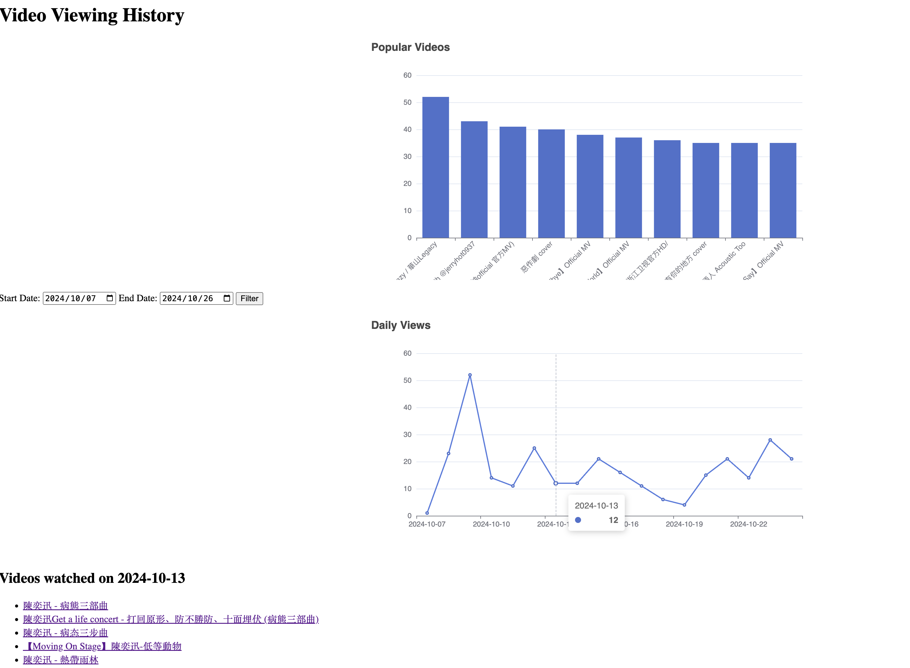

# YouTube History Viewer

<a href="https://www.producthunt.com/posts/yt-history?embed=true&utm_source=badge-featured&utm_medium=badge&utm_souce=badge-yt&#0045;history" target="_blank"></a>

This project is a web application that visualizes your YouTube viewing history. It provides insights into your watching patterns, including daily view counts and top watched videos. The application uses Flask for the backend and ECharts for data visualization.

## Features
- Daily view count chart
- Top watched videos chart
- Detailed list of videos watched on a selected date
- Date range filtering

## How to Export YouTube History from Google Takeout

To obtain your YouTube viewing history data, follow these steps:

1. Visit [Google Takeout](https://takeout.google.com/).

2. Ensure you're logged into the Google account containing your YouTube history.

3. In the product list, deselect all items, then select only "YouTube and YouTube Music".

4. Click the "All YouTube data included" button next to "YouTube and YouTube Music".

5. In the pop-up options, deselect all items, keeping only "history" checked.

6. Click "OK", then scroll to the bottom of the page and click "Next step".

7. Choose your preferred export frequency, file type, and size. For a one-time export, keep the default settings.

8. Click "Create export".

9. Wait for Google to prepare your data. This may take anywhere from a few minutes to several hours, depending on the amount of data.

10. Once ready, you'll receive an email. Click the download link in the email.

11. Download and unzip the file.

12. In the extracted folder, locate the `Takeout/YouTube and YouTube Music/history/watch-history.json` file.

13. Copy the `watch-history.json` file to the root directory of this project.

Now that you've successfully exported and prepared your YouTube viewing history data, you can proceed to run the application to visualize your viewing history.


## How to Run

1. Ensure you have Python 3.x installed.
2. Clone this repository.
3. Install the required dependencies:
   ```
   pdm install
   ```
4. Place your YouTube watch history JSON file (named `watch-history.json`) in the project root directory.
5. Run the Flask application:
   ```
   python main.py
   ```
6. Open a web browser and navigate to `http://localhost:5000` to view your YouTube history visualization.

# Effect



<a href="https://www.buymeacoffee.com/ronething" target="_blank"></a>
